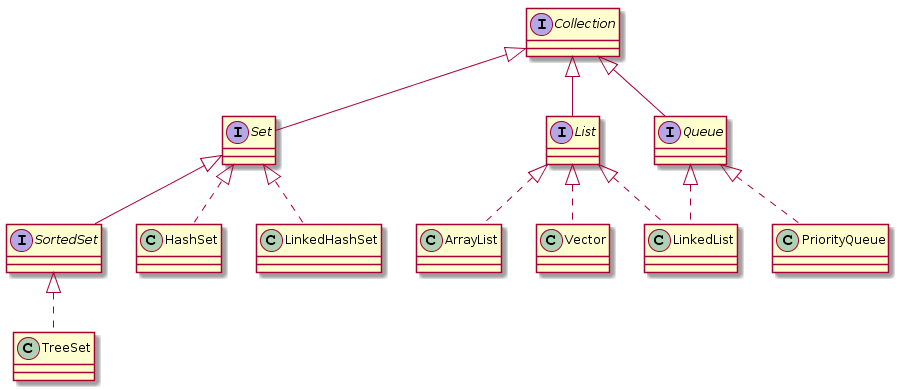
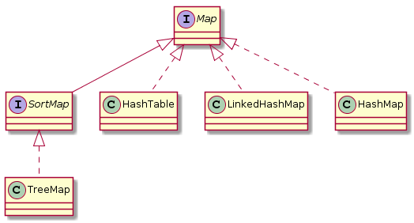
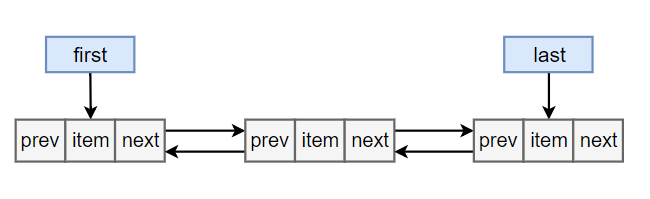

<!-- GFM-TOC -->
* [一、概览](#一概览)
    * [Collection](#Collection)
  	* [Map](#map)

* [二、具体分析](#二具体分析)
	* [ArrayList](#ArrayList)
	* [Vector](#Vector)
	* [LinkList](#LinkList)
	* [Arraylist 与 LinkedList 异同](#Arraylist-与-Linkedlist-异同)
	* [ArrayList 与 Vector 区别](#Arraylist-与-Vector-区别)
	* [HashSet如何检查重复](#HashSet如何检查重复)
	
<!-- GFM-TOC -->


# 一、概览

容器主要包括 Collection 和 Map 两种，Collection 存储着对象的集合，而 Map 存储着键值对（两个对象）的映射表。

## Collection

<div align="center">  </div><br>

### 1. Set

- TreeSet：基于红黑树实现，支持有序性操作，例如根据一个范围查找元素的操作。但是查找效率不如 HashSet，HashSet 查找的时间复杂度为 O(1)，TreeSet 则为 O(logN)。

- HashSet：基于哈希表实现，支持快速查找，但不支持有序性操作。并且失去了元素的插入顺序信息，也就是说使用 Iterator 遍历 HashSet 得到的结果是不确定的。

- LinkedHashSet：具有 HashSet 的查找效率，且内部使用双向链表维护元素的插入顺序。

### 2. List

- ArrayList：基于动态数组实现，支持随机访问。

- Vector：和 ArrayList 类似，但它是线程安全的。

- LinkedList：基于双向链表实现，只能顺序访问，但是可以快速地在链表中间插入和删除元素。不仅如此，LinkedList 还可以用作栈、队列和双向队列。

### 3. Queue

- LinkedList：可以用它来实现双向队列。

- PriorityQueue：基于堆结构实现，可以用它来实现优先队列。

## Map

<div align="center">  </div><br>

- HashMap：基于哈希表实现。

- HashTable：和 HashMap 类似，但它是线程安全的，这意味着同一时刻多个线程可以同时写入 HashTable 并且不会导致数据不一致。它是遗留类，不应该去使用它。现在可以使用 ConcurrentHashMap 来支持线程安全，并且 ConcurrentHashMap 的效率会更高，因为 ConcurrentHashMap 引入了分段锁。

- LinkedHashMap：使用双向链表来维护元素的顺序，顺序为插入顺序或者最近最少使用（LRU）顺序。
- TreeMap：基于红黑树实现。

# 二、具体分析

## ArrayList
### 1. 概览
实现了 RandomAccess 接口，因此支持随机访问。这是理所当然的，因为 ArrayList 是基于数组实现的。

```java
public class ArrayList<E> extends AbstractList<E>
        implements List<E>, RandomAccess, Cloneable, java.io.Serializable
```

数组的默认大小为 10。

### 2. 扩容

添加元素时使用 ensureCapacityInternal() 方法来保证容量足够，如果不够时，需要使用 grow() 方法进行扩容，新容量的大小为 `oldCapacity + (oldCapacity >> 1)`，也就是旧容量的 1.5 倍。

扩容操作需要调用 `Arrays.copyOf()` 把原数组整个复制到新数组中，这个操作代价很高，因此最好在创建 ArrayList 对象时就指定大概的容量大小，减少扩容操作的次数。

## Vector

它的实现与 ArrayList 类似，但是使用了 synchronized 进行同步。

## LinkedList

### 1. 概览

基于双向链表实现，使用 Node 存储链表节点信息。

```java
private static class Node<E> {
    E item;
    Node<E> next;
    Node<E> prev;
}
```

每个链表存储了 first 和 last 指针：

```java
transient Node<E> first;
transient Node<E> last;
```

<div align="center">  </div><br>


## Arraylist 与 LinkedList 异同

- **1. 是否保证线程安全：** ArrayList 和 LinkedList 都是不同步的，也就是不保证线程安全；
- **2. 底层数据结构：** Arraylist 底层使用的是Object数组；LinkedList 底层使用的是双向链表数据结构（JDK1.6之前为循环链表，JDK1.7取消了循环。注意双向链表和双向循环链表的区别：）； 详细可阅读[JDK1.7-LinkedList循环链表优化](https://www.cnblogs.com/xingele0917/p/3696593.html)
-  **3. 插入和删除是否受元素位置的影响：** ① **ArrayList 采用数组存储，所以插入和删除元素的时间复杂度受元素位置的影响。** 比如：执行`add(E e)  `方法的时候， ArrayList 会默认在将指定的元素追加到此列表的末尾，这种情况时间复杂度就是O(1)。但是如果要在指定位置 i 插入和删除元素的话（`add(int index, E element) `）时间复杂度就为 O(n-i)。因为在进行上述操作的时候集合中第 i 和第 i 个元素之后的(n-i)个元素都要执行向后位/向前移一位的操作。 ② **LinkedList 采用链表存储，所以插入，删除元素时间复杂度不受元素位置的影响，都是近似 O（1）而数组为近似 O（n）。**
- **4. 是否支持快速随机访问：** LinkedList 不支持高效的随机元素访问，而 ArrayList 支持。快速随机访问就是通过元素的序号快速获取元素对象(对应于`get(int index) `方法)。
- **5. 内存空间占用：** ArrayList的空 间浪费主要体现在在list列表的结尾会预留一定的容量空间，而LinkedList的空间花费则体现在它的每一个元素都需要消耗比ArrayList更多的空间（因为要存放直接后继和直接前驱以及数据）。 

## ArrayList 与 Vector 区别
- Arraylist不是同步的，所以在不需要保证线程安全时时建议使用Arraylist。

- Vector类的所有方法都是同步的。可以由两个线程安全地访问一个Vector对象、但是一个线程访问Vector的话代码要在同步操作上耗费大量的时间。

## HashSet如何检查重复
当你把对象加入HashSet时，HashSet会先计算对象的hashcode值来判断对象加入的位置，同时也会与其他加入的对象的hashcode值作比较，如果没有相符的hashcode，HashSet会假设对象没有重复出现。但是如果发现有相同hashcode值的对象，这时会调用equals（）方法来检查hashcode相等的对象是否真的相同。如果两者相同，HashSet就不会让加入操作成功。（摘自我的Java启蒙书《Head fist java》第二版）

**hashCode（）与equals（）的相关规定：**
1. 如果两个对象相等，则hashcode一定也是相同的
2. 两个对象相等,对两个equals方法返回true
3. 两个对象有相同的hashcode值，它们也不一定是相等的
4. 综上，equals方法被覆盖过，则hashCode方法也必须被覆盖
5. hashCode()的默认行为是对堆上的对象产生独特值。如果没有重写hashCode()，则该class的两个对象无论如何都不会相等（即使这两个对象指向相同的数据）。

**==与equals的区别**

1. ==是判断两个变量或实例是不是指向同一个内存空间    equals是判断两个变量或实例所指向的内存空间的值是不是相同
2. ==是指对内存地址进行比较    equals()是对字符串的内容进行比较3.==指引用是否相同    equals()指的是值是否相同

